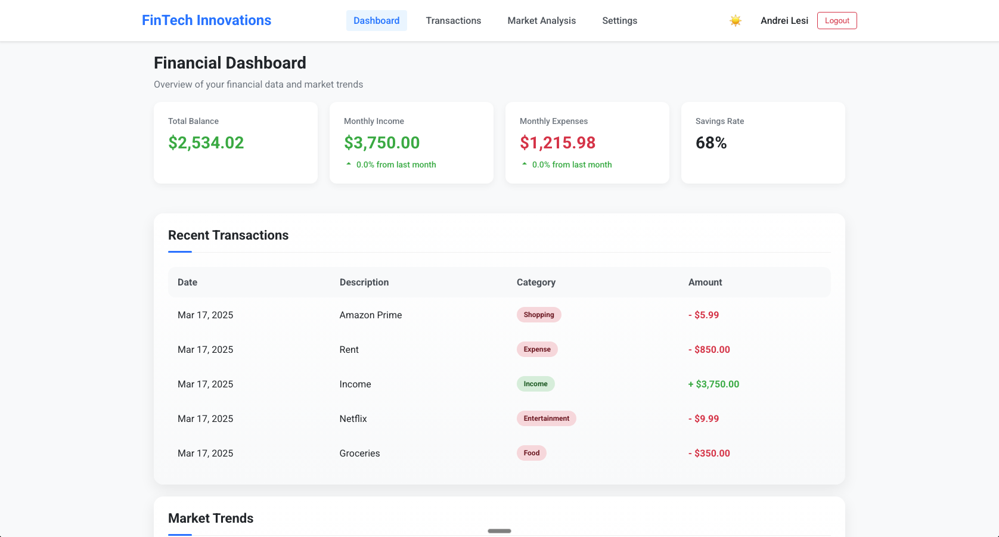
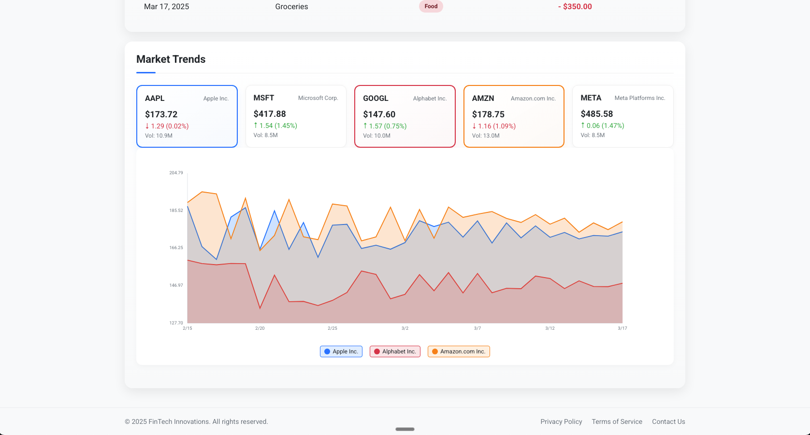
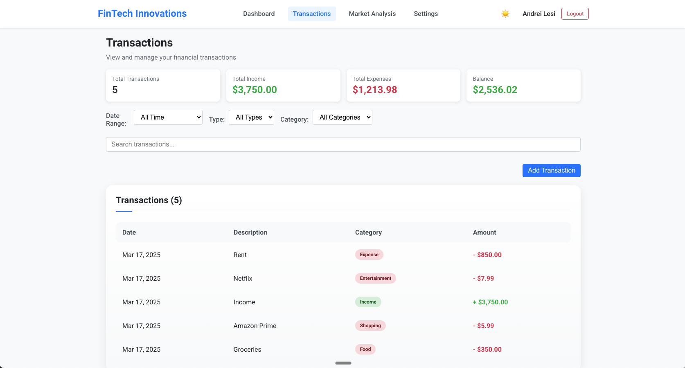
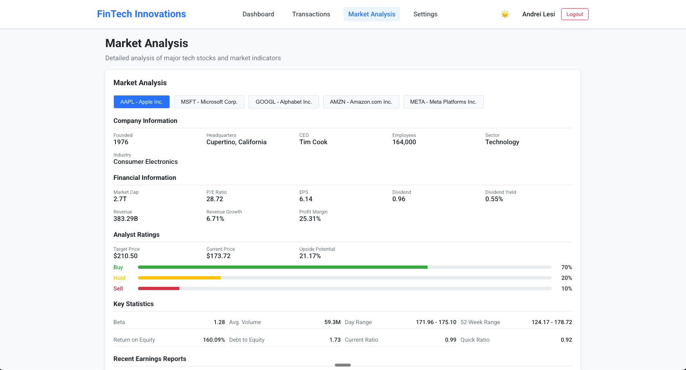
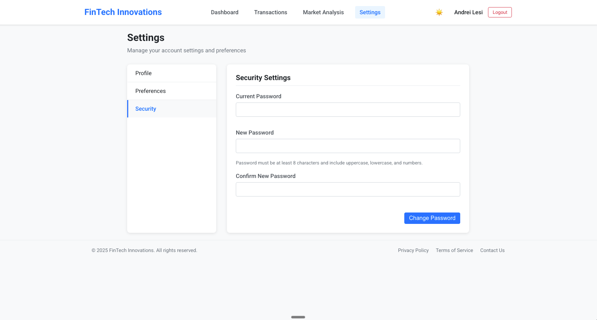
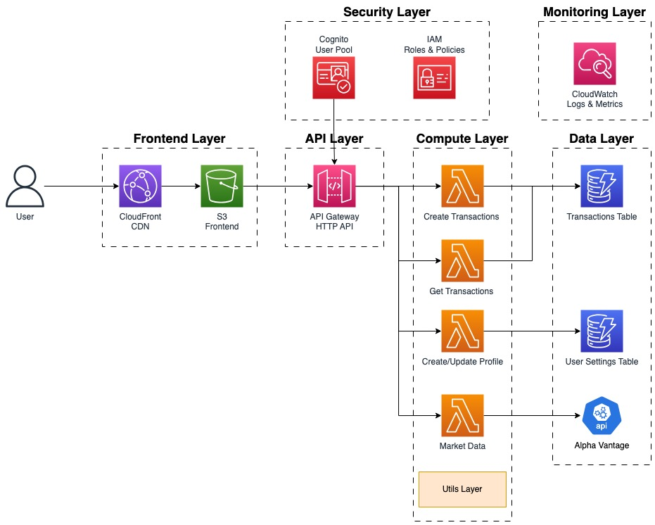

# Financial Dashboard - Serverless AWS Application

A modern financial dashboard application built with a serverless architecture on AWS, demonstrating cloud architecture and development skills through real-time financial data visualization and market analysis.



## Project Overview

This project showcases a comprehensive serverless application architecture on AWS, implementing best practices for cloud-native development. It serves as a demonstration of technical proficiency in serverless architecture, infrastructure as code, and modern frontend development.

## Features

- **User Authentication**: Secure login and registration with AWS Cognito
- **Financial Dashboard**: Interactive overview of financial metrics and market trends
- **Stock Market Data**: Real-time visualization of stock prices and historical data
- **Market Analysis**: Detailed analysis of major tech stocks (AAPL, MSFT, GOOGL, AMZN, META)
- **Transaction Management**: Track and manage financial transactions
- **User Profile**: Customizable user profiles and preferences

## Screenshots

### Market Trends


### Transactions


### Market Analysis


### User Settings


## Architecture

This application is built using a serverless architecture on AWS:



- **Frontend**: React.js hosted on S3 and distributed via CloudFront
- **Backend**: AWS Lambda functions with API Gateway
- **Authentication**: AWS Cognito
- **Database**: DynamoDB
- **Infrastructure as Code**: Terraform

For detailed architecture information, see the [Architecture Documentation](docs/architecture.md).

## Technology Stack

### Frontend
- React.js
- Styled Components
- React Router
- Axios
- Chart.js

### Backend
- AWS Lambda
- Amazon API Gateway
- Amazon DynamoDB
- Amazon Cognito
- AWS CloudWatch

### Infrastructure
- Terraform
- AWS S3
- AWS CloudFront
- AWS IAM

## Technical Implementation

The project demonstrates several key technical concepts:

- **Serverless Architecture**: Utilizing AWS Lambda for compute needs
- **Infrastructure as Code**: Managing AWS resources with Terraform
- **Authentication & Authorization**: Implementing secure user authentication with Cognito
- **NoSQL Database Design**: Structuring data for DynamoDB
- **API Design**: Creating RESTful APIs with API Gateway
- **Frontend Architecture**: Building a responsive React application
- **CI/CD Integration**: Automating deployment processes

## Deployment

The application can be deployed with a single command using the provided deployment script:

```bash
./deploy.sh
```

This script will:
1. Check for required tools and AWS credentials
2. Deploy the infrastructure using Terraform
3. Update the frontend environment variables
4. Build the frontend application
5. Deploy the frontend to S3
6. Display the deployment information

For detailed deployment instructions with step-by-step commands, see the [Deployment Guide](docs/deployment.md).

## Prerequisites

Before deploying this application, ensure you have the following installed:

- [AWS CLI](https://aws.amazon.com/cli/) configured with appropriate credentials
- [Terraform](https://www.terraform.io/downloads.html) (v1.0.0 or later)
- [Node.js](https://nodejs.org/) (v14.x or later) and npm

## Local Development

For local development:

```bash
cd src/frontend
npm install
npm start
```

## Documentation

The project documentation is divided into two main areas:

- [Architecture Documentation](docs/architecture.md) - Detailed overview of the system architecture, components, data flow, and security considerations
- [Deployment Guide](docs/deployment.md) - Step-by-step deployment instructions with actual commands for local development and AWS deployment

